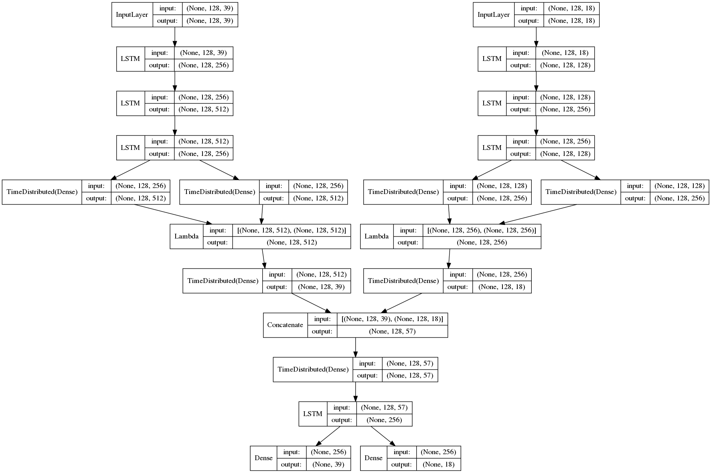

# musegen
**musegen** is a python library for music generation using the Keras API with tensorflow as backend.
Our goal is to generate standalone musical pieces in symbolic notation (midi files) which have a structural coherence and are aesthetically pleasing.

## Table of Contents

* [Project Structure ](#structure)
* [How to install](#install)
* [Goals](#goals)
* [Data Representation](#datarep)
* [Neural Network Architecture](#narch)

## Project Structure <a name="structure"></a>

```
.
├── models                  Contains the weights and the neural network architecture for each generator
├── samples                 Contains the music samples created by the generators
├── config.py               Holds configuration parameters used when training
├── helper.py               Provides basic helper functions
├── stats.py                Provides visualization and statistics of the dataset
├── pitch-embedding.py      Deprecated neural network that creates embeddings for pitches
├── *-generator.py          Contain the neural network architecture definitions and training procedure
└── musegen.py              Uses a specific generator to create music samples
```

## How to install <a name="install"></a>

Clone the project, then execute the following

```
cd musegen
python3 musegen.py
```

The above runs the _musegen_ script which loads the most recently trained neural network and uses the pre-trained weights to generate some music samples. Note that the cloned project already comes with some created samples.

## Goals <a name="goals"></a>

We begin by proposing solutions to the following simpler problems, before attempting to produce end-to-end musical pieces:

- [x] generation of monophonic pitches
- [x] generation of monophonic notes (Currently active)
- [ ] generation of polyphonic pitches 
- [ ] generation of polyphonic notes

###### Note: A pitch is an arbitrary symbolic name that corresponds to a particular frequency of sound. We only care about the symbolic name of a pitch. A note holds information about a pitch and a duration.

## Dataset and Data Representation <a name="datarep"></a>

The dataset that we currently employ is comprised of 300 chorales of J.S. Bach and can be directly found in the [music21](http://web.mit.edu/music21/) python library. 

Before feeding the data into the neural network for training, we preprocess them as follows:
- Every piece is transposed to C major/A minor, based on the mode of its original key.
- Notes and rests in midi format (distinct integer values with an associated duration) are the only elements kept (accidentals, dynamics and other similiar components are discarded for simplicity). They are organized in an array.
- At the end of each piece, a special token marking the end of it is inserted.

Afterwards, based on the distinct values of the preprocessed data, we create vocabularies for pitches and durations that map the corresponding data to consecutive integers, thus allowing us to transform them to categorical vectors.

Finally, we split the pitches and durations into two independent arrays, and then create sequences (currently of length equal to 128) to be used as input to the neural network, while, in parallel, we encode the data using the created vocabularies. Note that an embedding is not currently used.

The expected output for each input sequence is the element following the final element of a given input sequence.

## Neural Network Architecture <a name="narch"></a>

The current neural network architecture is split into three sub-networks.

This first one is composed of two sequential and structurally identical models, one for the pitch and the other for the duration sequences. The models have the following components:

- Three LSTM layers with varying units.
- A Variational Autoencoder which introduces randomness in the generation process.
- A final Dense layer with softmax activation.

The second sub-network concatenates the two outputs of the previous structure and uses a Dense along with a LSTM layer. This shared model is required to coordinate the pitches and durations, since they are generated independently by the previous model.

The final sub-network is composed of two Dense softmax layers which form the two outputs of the neural network, that is a probability distribution for the next pitch and duration to be played.

We then choose the elements with the highest probability for each generated output and reverse their encoding - by using the vocabularies created prior to training - thus creating a sequence of symbolic notes. This final sequence represents the generated musical piece and is exported to a midi file.

The neural network previously described is depicted below:

